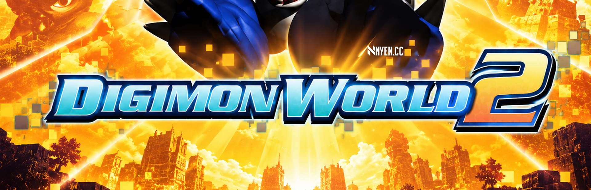

<p align="center">
  
</p>

<h1 align="center">Digimon World 2 PC Port</h1>

<p align="center">
  <i>Digimon World 2</i> (PlayStation, 2000) running natively on Windows and Linux,<br>
  built from the game's own decompiled C code.
</p>

<p align="center">
  <a href="https://github.com/Wyrelade/DW2-PC/releases/latest/download/DW2-PC-windows-x64.zip"></a>
  &nbsp;
  <a href="https://github.com/Wyrelade/DW2-PC/releases/latest/download/DW2-PC-linux-x64.zip"></a>
</p>

<p align="center">
  <a href="https://github.com/Wyrelade/DW2-PC/releases"></a>
  
  
  
</p>

<p align="center"><sub>
  No release yet. The download buttons start working with the first release; until then you can
  <a href="#building">build it yourself</a>.
</sub></p>

<p align="center">
  <a href="#features">Features</a> &middot;
  <a href="#getting-started">Getting started</a> &middot;
  <a href="#controls">Controls</a> &middot;
  <a href="#roadmap">Roadmap</a> &middot;
  <a href="#building">Building</a> &middot;
  <a href="#how-it-works">How it works</a>
</p>

---

## About

This is not an emulator and not a remake. The
[Digimon World 2 decompilation](https://github.com/Wyrelade/Digimon-World-2-Decomp) turned all
1088 functions of the game into C that rebuilds the retail disc byte for byte. This port compiles
that same C for the PC and replaces the PlayStation's libraries and hardware with a PC layer on
SDL3.

The game logic is the original code: battles, damage, digivolution, DNA, the domains, the text
and the music behave as on the PS1. What changes is how it looks and how you play it: sharper 3D
at higher resolutions, a widescreen view, polygons that no longer wobble, gamepads, and saves
that are plain files.

> [!IMPORTANT]
> **You need your own copy of the game.** This repository and its downloads contain no disc
> image and no game data (graphics, models, sound, text or code from the disc). The port reads
> its data from a pack file that is built on your PC from your own disc image (USA,
> `SLUS-01193`) and checked file by file against a list of hashes. A disc that does not match
> is rejected.

## Features

### Graphics

| | |
|---|---|
| **Render scale 1x to 8x** | 3D is drawn at up to 8 times the PS1 resolution (2560x1920 at 8x). Textures and 2D art keep their original pixels, so the look stays the same, only cleaner. |
| **No wobble** | The PS1 snaps every vertex to whole pixels and maps textures without perspective, which makes polygons shake and textures warp. The port keeps precise vertex positions and draws textures with correct perspective. |
| **Widescreen 16:9** | A wider view of the 3D world, made by widening the camera, not by stretching the picture. Menus, text boxes and the HUD keep their 4:3 layout. |
| **Sharpening** | Optional contrast adaptive sharpening of the scaled picture (strength 0 to 100, off by default), on the graphics card or on the CPU with the software renderer. Edges get crisper without halos. F8 turns it on and off. |
| **GPU renderer** | Drawing runs on the graphics card through SDL_GPU (Vulkan). A software renderer stays as a fallback. |
| **Exact frame timing** | The game runs at the PS1's 59.94 Hz, paced to the real clock, on its own thread, so dragging or resizing the window does not stall it. |
| **Window modes** | Windowed, borderless fullscreen at the desktop resolution, or exclusive fullscreen at a resolution and refresh rate you pick. F11 switches between windowed and fullscreen; a short notice in the top left names the mode. The window's size and place are remembered. |
| **Movies** | The intro, the story scenes and the ending play from your disc's movie files, decoded like the PS1's movie decoder chip at the original 15 frames per second. Start skips them, as on the PS1. Their sound plays with them (streamed CD audio). |
| **Streamed CD audio** | The sound the PS1 streams from the disc (XA): the skill voice lines in battle and VS, the DigiLab DNA scene and the movie sound. Decoded like the PS1's CD controller (same ADPCM decode and the same resampling to 44.1 kHz) and mixed into the emulated sound chip at the game's CD volume. |
| **Classic picture** | At 1x with the extras off, the picture is the PS1 picture: automated runs compare it with reference screenshots frame by frame. |

### Play

| | |
|---|---|
| **Settings window** | F1 opens the settings: render scale, 16:9, no wobble, sharpening, renderer, window mode, key and gamepad remap, left stick as D-pad, volume. Changes apply at once and are saved to `settings.ini`. The title screen shows "Press F1 for settings" in the corner (can be switched off). |
| **Gamepads** | Any controller SDL3 knows (Xbox, PlayStation, Switch Pro and others), mapped by button position, and it can be plugged in while the game runs. The left stick moves like the D-pad. |
| **Keyboard** | Full keyboard play out of the box, every key can be changed in F1. |
| **Two players** | VS mode with two gamepads, or on one keyboard by switching the port with Tab (`--pad2-keys`). |
| **Saves as files** | Memory cards are files (`card1.mcd`, `card2.mcd`) in your user folder. Raw card images from DuckStation, PCSX-Redux or ePSXe load as they are, so a save from an emulator carries over. |
| **Screenshots** | F12 saves the current picture as PNG. |
| **Safe quit** | Esc asks before quitting, so a stray key press does not lose progress. |
| **64-bit and Linux** | Native Windows x64 and Linux x64 builds (32-bit Windows too). |

### What stays original

Game rules, battle formulas, random numbers, enemy behaviour, text, music and sound effects
(the game's own sound driver on an emulated PS1 sound chip). Nothing is rebalanced or rewritten.

## Getting started

1. Download the zip for your system and unpack it anywhere.
2. Put your disc image in the same folder as `dw2.exe`. It must be a raw dump with 2352-byte
   sectors: `.bin` + `.cue`, a CloneCD `.img`, or a raw `.iso`. A 2048-byte `.iso` does not
   work (it has lost the audio and movie sectors); the game tells you if you have one.
3. Start `dw2.exe` (Windows) or `./dw2` (Linux). On the first start the game checks your image
   file by file, writes its data pack `dw2.pak` next to the exe (a few seconds) and starts. If
   it finds no image, it asks for one. After that the image is not needed any more.

You can also drop the image onto `dw2.exe`, or pass it with `--disc PATH`. The image may also
sit in the user data folder (`%APPDATA%\DW2-Online\` on Windows, `~/.local/share/DW2-Online/`
on Linux); the pack goes there too when the exe's folder is not writable.

Saves are in `%APPDATA%\DW2-Online\saves\` on Windows and `~/.local/share/DW2-Online/saves/`
on Linux. To bring a save from an emulator, copy its memory card file there as `card1.mcd`.

## Controls

Default bindings (change them in the F1 settings window):

| PS1 | Keyboard | Gamepad |
|---|---|---|
| D-pad | Arrow keys | D-pad, left stick |
| Cross | Z | South button (A on Xbox) |
| Circle | X | East button |
| Square | A | West button |
| Triangle | S | North button |
| L1 / R1 | Q / W | Shoulder buttons |
| L2 / R2 | E / R | Triggers |
| Start | Enter | Start |
| Select | Backspace, Right Shift | Back / Select |

| Key | Does |
|---|---|
| F1 | Settings window (Esc closes it) |
| F5 | Render scale 1x .. 8x |
| F6 | No wobble on / off |
| F7 | 16:9 on / off |
| F8 | Sharpening on / off |
| F11 | Windowed / fullscreen |
| F12 | Screenshot |
| Esc | Quit (asks first) |

Command line options (`dw2 --help` lists all of them):

| Option | Does |
|---|---|
| `--scale N` | start at render scale N (1 to 8) |
| `--wide` | start in 16:9 |
| `--pgxp` | start with no wobble on |
| `--sharpen N` | sharpening strength 0 to 100 (needs scale 2 or more) |
| `--renderer gpu\|soft` | GPU (default) or software drawing |
| `--disc PATH` | build the pack from this disc image |
| `--pak PATH` | use a pack from another place |
| `--save-dir DIR` | keep the memory cards in DIR |
| `--pad2-keys` | two players on one keyboard (Tab switches the port) |
| `--settings PATH` | use another settings file |
| `--fullscreen` / `--windowed` | start in borderless fullscreen / in a window |
| `--window-mode M` | start `windowed`, `borderless` or `exclusive` |

## Settings

F1 opens the settings window over the running game (mouse, keyboard or gamepad). The game
does not see your input while it is open.

- **Display:** render scale, 16:9, no wobble, sharpening (the same as F5 / F7 / F6 / F8, which
  stay in sync with it; sharpening works on scales 2x and up), the title screen hint, renderer
  (GPU or software, used from the next start), window mode (windowed, borderless fullscreen,
  exclusive fullscreen; the same as F11), the display to go fullscreen on, and the resolution
  for exclusive fullscreen.
- **Controls:** two keys and one gamepad button per PS1 button. Click a slot and press the key
  or button; right click clears it; Esc cancels. Esc, Tab and the F keys are reserved. Left
  stick as D-pad on / off. Reset restores the defaults.
- **Sound:** volume.

Settings are saved in `settings.ini` in the user data folder (`%APPDATA%\DW2-Online\` on
Windows, `~/.local/share/DW2-Online/` on Linux) when you change something. It is a plain text
file (`key = value` lines) you can edit by hand; lines the game does not know are kept, and a
bad value falls back to its default. Without the file the game starts with the defaults.
Command line options such as `--scale 4` or `--fullscreen` win over the file for that run and
are not saved. The window's size, place and maximized state are saved when you change them.

## Roadmap

Planned for the first release:

- [x] **No setup:** put the program next to your disc image (`.cue` / `.bin` / `.iso` / `.img`)
      or pick it once; the game checks it, builds its pack and starts.
- [x] **F1 settings window:** key and gamepad remap, left stick as D-pad, render scale, 16:9,
      no wobble, renderer, volume, saved to a settings file.
- [x] **Window modes:** windowed, borderless fullscreen, exclusive fullscreen; F11 and F1,
      saved with the window's size and place.
- [x] **Sharpening filter** for the scaled picture (GPU and software), in F1 and on F8.
- [x] **"Press F1 for settings"** hint on the title screen.
- [x] **Movies:** the intro, the story scenes and the endings, Start skips.
- [x] **Streamed CD audio** (XA): battle voice lines, the DigiLab DNA scene, movie sound.
- [ ] **Full playthrough check** from the start to the ending, every scene on 64-bit.

Done so far: the whole game code compiles and runs (title, city, domains, battles, menus,
saves, VS mode), movies, streamed CD audio, render scale, no wobble, 16:9, sharpening, GPU renderer, F1 settings, window modes,
64-bit and Linux builds.

## Building

Windows (any shell):

- [WinLibs](https://winlibs.com/) MinGW-w64 GCC (x86_64 or i686); set `DW2_MINGW` to its root
- [SDL3](https://github.com/libsdl-org/SDL/releases) MinGW development release; set `DW2_SDL3` to its root
- Python 3, then `pip install -r requirements.txt` (brings Ninja)

```
python tools/build_native.py --arch x64 --release    # -> build/native64_rel/dw2.exe
```

Linux: gcc, CMake, Ninja and `libsdl3-dev`, then:

```
python3 tools/build_native.py --release              # -> build/linux64_rel/dw2
```

A few data tables are taken from your disc while building (`configs/USA/include_bin.txt`), so
the build also needs the disc's files extracted to `dumps/disc/` with `dumpsxiso -pt`. Builds
without `--release` add developer tools (an overlay on F2 with timing, tasks, memory, save data
and a game data browser).

The matching PS1 build is still in this tree: `python3 tools/build_dw2.py` rebuilds the retail
executable and all 7 stage overlays byte-identical. The decomp repository explains that side.

## How it works

```
src/       the game's C from the decomp (original logic; 64-bit fixes marked DW2_NATIVE)
psyq/      PC versions of the PlayStation libraries the game calls (graphics, sound, CD, pad, card)
backend/   emulated PS1 GPU, sound chip, CD audio decoder and movie decoder, the HD renderer (scale, no wobble, 16:9, SDL_GPU)
host/      SDL3 window, input, audio output, memory card files, the data pack
tools/     build scripts, dw2pack.py (pack builder), decomp tools
doc/       game state map, pack format, notes on the PlayStation library calls
```

- The PS1 loaded the game's 7 stage overlays (city, domains, battle, title, memory card, VS
  battle, debug menu) one at a time into the same memory. Here they are linked into one
  program, and a scene switch resets an overlay's data the way the original reload did.
- Game memory stays below 2 GB, so the original 32-bit structures work unchanged in the 64-bit
  build.
- The data pack (`doc/PACK_FORMAT.md`) holds the disc's files as the game reads them. The game
  builds it from your image on the first start (`host/pakbuild.c`; `tools/dw2pack.py` writes
  the same file), and every file is checked against `configs/USA/pack_manifest.txt`, which
  holds hashes only, no game data.

## Credits

- **[Wyrelade](https://github.com/Wyrelade)**: founder and lead of the project; the
  [Digimon World 2 decompilation](https://github.com/Wyrelade/Digimon-World-2-Decomp) and this
  PC port.
- Decomp workflow and toolchain derived from the Parasite Eve 2 decomp.
- DW2 file-format documentation by RmBeastbow.
- Thanks to ThirstyWraith for the stage overlay and battle notes.
- [SDL3](https://libsdl.org/) (zlib license), [Dear ImGui](https://github.com/ocornut/imgui)
  (MIT license, `host/imgui/LICENSE.txt`).

## License

The project code is [CC0 1.0](LICENSE). Digimon World 2, its data, its characters and its logo
belong to their owners. No game data is in this repository or its downloads; the banner
(`misc/banner.png`) is fan art and uses the game's logo only to name the game.

---

<p align="center">
  <a href="https://nyen.cc/"></a>
  <br>
  <sub>Powered by <a href="https://nyen.cc/"><b>NYEN</b></a></sub>
</p>
